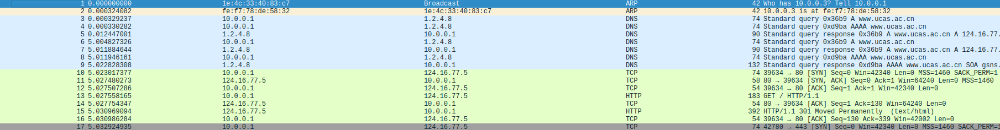
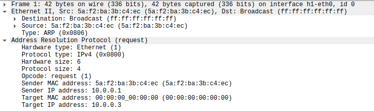
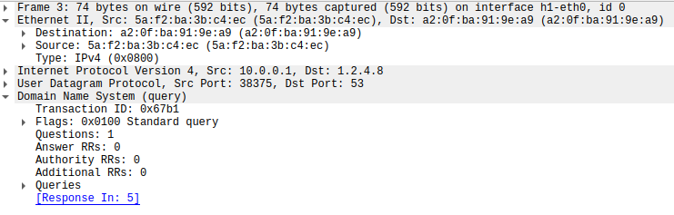
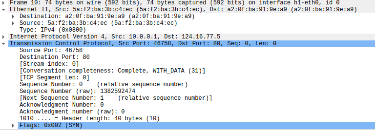
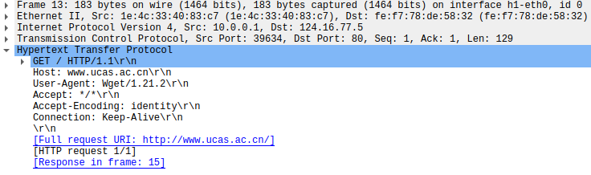
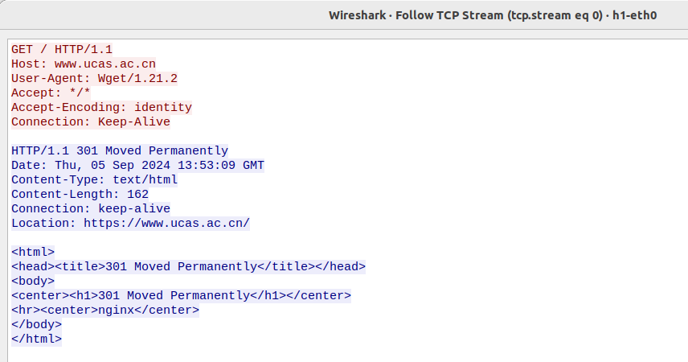
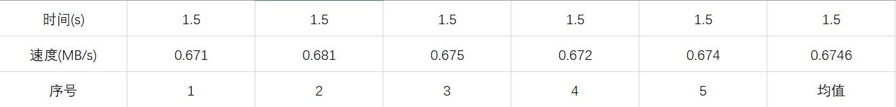
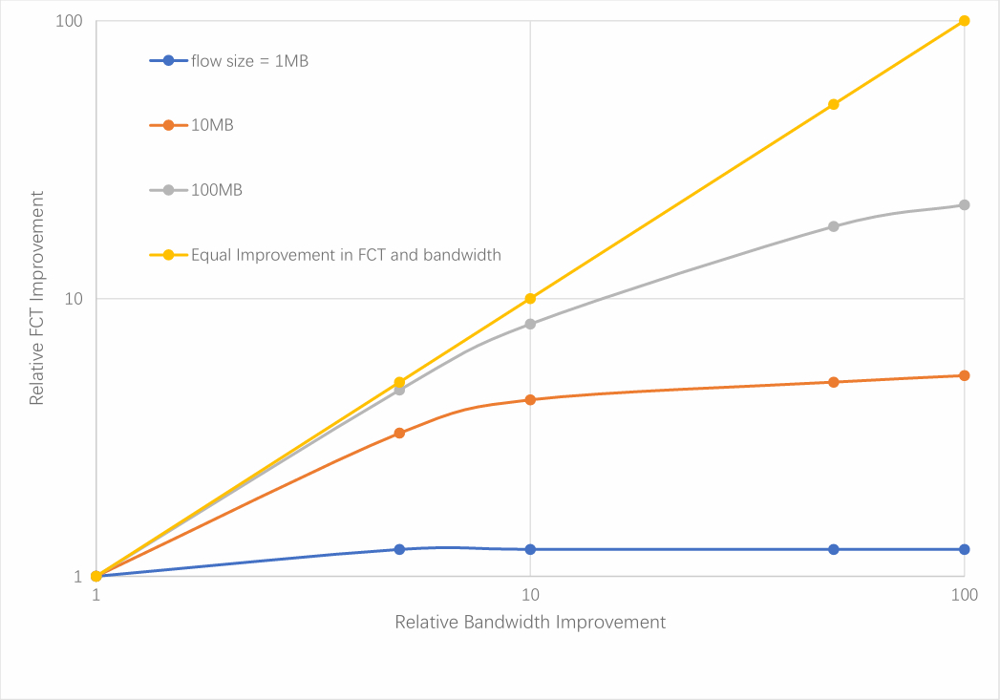

# 互联网协议实验与流完成时间实验

学号：2022K8009929011  
姓名：王泽黎  

---

## 实验一：互联网协议实验

### 一、实验一：实验任务

1. 利用wireshark观察wget的过程  
2. 调研并解释这个过程  
3. 理解相关协议的封装  

### 二、实验一：实验流程

1. 在终端上执行sudo mn --nat，将host连接至Internet，启动mininet  
2. 在mininet中输入xterm h1，打开h1的终端
3. 在h1终端中输入echo "nameserver 1.2.4.8" > /etc/resolv.conf，设置DNS服务器
4. 在h1终端中输入wireshark &，打开wireshark
5. 在wireshark中选择h1-eth0，开始抓包
6. 在h1终端中输入wget [www.ucas.ac.cn]，观察wireshark的抓包过程  
7. 调研分析抓包过程以及所得的几种互联网协议

### 三、实验一：实验结果与分析

#### （一）wireshark抓包过程

  

#### （二）ARP协议层次

  
分析结果为：Ethernet < ARP

#### （三）DNS协议层次

  
分析结果为：Ethernet < IP < UDP < DNS

#### （四）TCP协议层次

  
分析结果为：Ethernet < IP < TCP

#### （五）HTTP协议层次

  
分析结果为：Ethernet < IP < TCP < HTTP

#### （六）结果分析

在获取UCAS官网的过程中，wireshark抓包得到了ARP、DNS、TCP、HTTP等协议的封装层次：  
&nbsp;&nbsp;&nbsp;&nbsp;1. ARP协议层次为Ethernet < ARP
&nbsp;&nbsp;&nbsp;&nbsp;2. DNS协议层次为Ethernet < IP < UDP < DNS
&nbsp;&nbsp;&nbsp;&nbsp;3. TCP协议层次为Ethernet < IP < TCP
&nbsp;&nbsp;&nbsp;&nbsp;4. HTTP协议层次为Ethernet < IP < TCP < HTTP

从wireshark抓包结果看出TCP承载HTTP协议  

### 四、实验一：调研分析

#### （一）ARP（地址解析协议）

ARP协议“Address Resolution Protocol”(地址解析协议)的缩写。其作用是在以太网环境中，数据的传输所依懒的是MAC地址而非IP地址，而将已知IP地址转换为MAC地址的工作是由ARP协议来完成的。  

在局域网中，网络中实际传输的是“帧”，帧里面是有目标主机的MAC地址的。在以太网中，一个主机和另一个主机进行直接通信，必须要知道目标主机的MAC地址。目标MAC地址是通过地址解析协议获得的。所谓“地址解析”就是主机在发送帧前将目标IP地址转换成目标 MAC 地址的过程。ARP 协议的基本功能就是通过目标设备的 IP 地址，查询目标设备的MAC地址，以保证通信的顺利进行。ARP通过发送一个ARP请求帧到局域网中的所有设备来查找目标设备的MAC地址。这个请求包含源设备的IP地址和MAC地址。目标设备收到请求后，会回复一个包含其IP地址和MAC地址的ARP响应帧。

#### （二）DNS（域名系统）

DNS (Domain Name System)是一个应用层协议，域名系统(DNS)的作用是将人类可读的域名(如[www.example.com])转换为机器可读的IP地址(如192.0.2.44)。 DNS系统使用树状层次结构，包括多个 DNS 服务器，它们负责不同的域名解析。当用户输入一个域名时，客户端的DNS解析器将向根DNS服务器发送查询，然后逐级查询更低级别的DNS服务器，直到找到与域名相关的IP地址。

DNS协议建立在UDP或TCP协议之上，默认使用53号端口。客户端默认通过UDP协议进行通讯，但是由于广域网中不适合传输过大的 UDP 数据包，因此规定当报文长度超过了512 字节时，应转换为使用TCP协议进行数据传输。DNS是一种可以将域名和IP地址相互映射的以层次结构分布的数据库系统。

#### （三）TCP（传输控制协议）

TCP (Transmission Control Protocol 传输控制协议)是一种面向连接的、可靠的、基于字节流的传输层通信协议，由IETF的RFC 793定义。在简化的计算机网络OSI模型中，它完成第四层传输层所指定的功能。  

应用层向TCP层发送用于网间传输的、用8位字节表示的数据流，然后TCP把数据流分区成适当长度的报文段(通常受该计算机连接的网络的数据链路层的最大传输单元(MTU)的限制) 。之后TCP把结果包传给IP层，由它来通过网络将包传送给接收端实体的TCP层。TCP将用户数据打包构成报文段，它发送数据时启动一个定时器，另一端收到数据进行确认，对失序的数据重新排序，丢弃重复的数据。简单说， TCP协议的作用是，保证数据通信的完整性和可靠性，防止丢包。

#### （四）HTTP（超文本传输协议）

HTTP协议(超文本传输协议HyperText Transfer Protocol)，它是基于TCP协议的应用层传输协议，用于从WWW服务器传输超文本到本地浏览器的传输协议， HTTP是一个应用层协议，由请求和响应构成，是一个标准的客户端和服务器模型，简单来说就是客户端和服务端进行数据传输的一种规则。它指定了客户端可能发送给服务器什么样的消息以及得到什么样的响应。客户端发送HTTP请求到服务器，请求特定资源（如网页或图像）。服务器收到请求后，会发送HTTP响应，包含请求的资源以及相关信息。HTTP通信通常是无状态的，每个请求和响应都独立于之前的请求和响应。

### 五、实验一：实验总结

通过本次实验，我了解了互联网协议的封装过程，掌握了wireshark的使用方法，对ARP、DNS、TCP、HTTP等协议的封装层次有了更深入的了解。同时，我还调研了这几种协议的作用和功能，对互联网协议的工作原理有了更深入的认识。

---

## 实验二：流完成时间实验

### 一、实验二：实验任务  

1. 利用fct_exp.py脚本复现讲义上的图，每个数据点做5次实验，取均值  
2. 调研解释图中的现象。

### 二、实验二：实验流程

1. 在Python脚本中设定带宽及延迟  
2. 在终端中输入 sudo python fct_exp.py  
3. 在终端中输入 xterm h1 h2 中启动h1、h2两个host  
4. 在h2 终端输入 dd if=/dev/zero of=file_sizeMB.dat bs=file_sizeM count=1，其中file_size 分别设置为 1，10， 100进行不同大小的实验  
5. 在h1终端中输入wget [http://10.0.0.2/file_sizeMB.dat] 获取主机 h2 上对应大小的文件  
6. 记录每次完成传输的时间和速度，每个数据点做五次实验，取均值  
7. 根据结果绘图

### 三、实验二：实验结果与分析

#### （一）带宽为10Mbps下的实验结果（延迟为100ms）

（1）1MB数据包传输结果

（2）10MB数据包传输结果

（3）100MB数据包传输结果

#### （二）带宽为50Mbps下的实验结果（延迟为100ms）

（1）1MB数据包传输结果

（2）10MB数据包传输结果

（3）100MB数据包传输结果

#### （三）带宽为100Mbps下的实验结果（延迟为100ms）

（1）1MB数据包传输结果

(2) 10MB数据包传输结果

(3) 100MB数据包传输结果

#### （四）带宽为500Mbps下的实验结果（延迟为100ms）

（1）1MB数据包传输结果

（2）10MB数据包传输结果

（3）100MB数据包传输结果

#### （五）带宽为1GBps下的实验结果（延迟为100ms）

（1）1MB数据包传输结果

（2）10MB数据包传输结果

（3）100MB数据包传输结果

#### （六）结果绘图

我们使用对数坐标系，横纵坐标是带宽和 FCT 的改进，对于纵坐标，我们将最长的耗时作为分子，每个耗时的数据作为分母，以此作为纵坐标来体现FCT的改进横坐标则是每个带宽和最小带宽的比值，这样定义的横纵坐标可以用来表示带宽的改进和FCT的改进，绘图如下：

由图可得：

1. 当带宽一定时，数据包越大，网络传输速率越高，数据包越小，网络传输速率越低  
2. 当带宽到达50Mbps时，1MB的包速率不再发生变化（时间耗时均为1.2s）  
3. 当数据包大小不变时，网络传输速率不会随着带宽线性增加  

此外，根据改变延迟实验结果（未列出），我们可以发现，减小延迟可以显著增加高带宽、大数据包的传输速率。

### 四、实验二：调研分析

#### （一）TCP传输  

TCP 协议会将应用层的数据流分割成适当长度的报文段，最大传输段大小（MSS）通常受该计算机连接的网络的数据链路层的最大传送单元（MTU）限制。而 TCP 的传输速率是由其阻塞算法决定的，TCP 拥塞算法缓慢地探测网络的可用带宽，增加传输速率直到检测到分组丢失，然后指数地降低传输速率。

当数据包大小不变带宽增加时，该算法会增加传输速率直至分组丢失，而降低传输速率时指数级的，因此速率并不会随着带宽的增加而线性增加。  

同时，对数据进行分组也会造成丢包、排队、阻塞等问题，这也会影响到传输速率的增长。

#### （二）慢启动机制  

慢启动是TCP使用的一种阻塞控制机制。慢启动也叫做指数增长期。慢启动是指每次TCP接收窗口收到确认时都会增长。增加的大小就是已确认段的数目。这种情况一直保持到要么没有收到一些段，要么窗口大小到达预先定义的阈值。如果发生丢失事件， TCP就认为这是网络阻塞，就会采取措施减轻网络拥挤。一旦发生丢失事件或者到达阈值， TCP就会进入线性增长阶段。这时，每经过一个RTT窗口增长一个段。  

由于TCP连接会随着时间进行自我调谐，起初会限制连接的最大速度，如果数据传输成功，会随着时间的推移提高传输速度，这就是TCP的慢启动机制。  

这样就解释了在带宽较高时，小数据包没有达到期待的网速的问题。在慢启动阶段， TCP 预留的窗口大小会随着每接受到一个段而指数级增长，对于数据包大小较小的包，在窗口还没有达到带宽的阈值时可能传输就已经结束了，因此此时测得的传输速率会明显小于对应带宽的最大速率。  

### 五、实验二：实验总结

这次实验使用了实际的数据，给我带来的直观且深刻的印象。加深了我对TCP协议的认识，也让我进一步熟悉了实验环境的使用，同时对影响网速的因素有了浅显的认识。  
