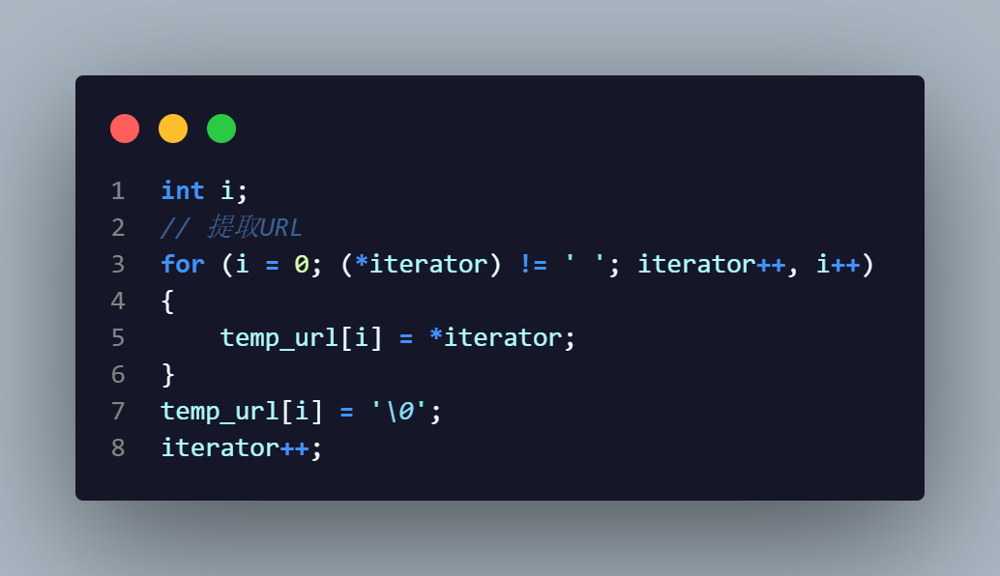

# Socket应用编辑实验

学号：2022K8009929011  
姓名：王泽黎  

---

## 一、实验任务

## 二、实验流程

## 三、实验结果与分析

### （一）HTTP服务器设计  

  

这段代码的作用是创建两个线程，分别执行 HTTP_SERVER 和 HTTPS_SERVER 函数，并在主线程中等待这两个线程完成。通过这种方式，可以同时处理 HTTP 和 HTTPS 请求，实现简单的并发服务器功能。  

其中HTTP_SERVER用于支持HTTP，HTTPS_SERVER用于支持HTTPS，下面是对这两个函数的具体介绍  

#### （1）HTTP_SERVER  

HTTP 服务器首先是建立 socket 文件描述符，然后绑定监听地址，进而对80接口进行监听，循环不断接收连接请求，在每收到一个服务器的连接后，创建一个
新的线程用于接收并解析其HTTP请求，然后根据请求内容进行应答。  

其中 handle_http_request 函数用于处理 HTTP 请求。  

首先是接受客户端的request报文，并检查是否为GET请求。  

  

然后根据request 得到相应的 https URL（这里考虑了是相对的 URL 还是绝对的 URL），最后返回301 Moved Permanently，并在应答中使用 Location 字段表达相应的 https URL。  

  

从 request 中获取 URL，若为相对路径，则获取Host字段后的信息，然后与相对路径的URL进行拼接，若为绝对路径，则直接写入响应信息。最后将生成的服务器响应发送给客户端即可。  

  

#### （2）HTTPS_SERVER

基本逻辑与HTTP_SERVER类似，使用OpenSSL库来进行加密通信。  

其中 handle_https_request 函数用于处理 HTTPS 请求。  

首先第一步是执行SSL握手，然后由于客户端可能需要继续保持连接，这里设置了一个变量（keep-alive）用于处理需要继续保持连接的情况。之后开始接受客户端的request报文，并检查是否为GET请求，然后对请求进行解析，得到请求的相关信息。而根据解析的信息，确定要发送的文件路径。如果文件不存在，发送一个404错误响应，否则看是否有Range字段，如果有Range字段，返回206 Partial Content，若没有会返回200 OK。而如果文件存在，会根据请求返回文件的对应部分的内容。  

SSL握手：

Range字段的解析：

  

判断是否需要继续保持连接:

### （二）实验结果  

  

## 四、实验总结

通过本次实验，我对Socket API有了一定的了解。Socket API对上层提供统一的调用接口，提供最基本的网络通信功能。通过实际编写一个简单的HTTP服务器，我对于建立Socket描述符、建立连接等内容以及HTTPS加密通信都有了不少了解，对于客户端、服务器之间的交互机制也有了一定的认识。此外我也学到了HTTP协议的内容，主要是对HTTP报文的结构有了不少了解，对HTTPS与HTTP的区别也有了更深的认识，因此本次实验让我对网络文件传输有了更深的理解。  
