# 交换机转发实验

学号：2022K8009929011  
姓名：王泽黎  

---

## 实验任务一（hub）

### 一、任务一：实验目的

了解广播网络的原理，实现节点广播的 broadcast_packet 函数。验证广播网络能够正常运行，并通过 iperf 测试广播网络的效率，掌握其运行特点。最后构建环形拓扑网络，验证该拓扑下节点广播会产生数据包环路。

### 二、任务一：实验流程

1. 实现节点广播的 broadcast_packet 函数
2. 验证广播网络能够正常运行
   - 从一个端节点 ping 另一个端节点
3. 验证广播网络的效率
   - 在 three_nodes_bw.py 进行 iperf 测量
   - 两种场景：h1 同时向 h2 和 h3 测量；h2 和 h3 同时向 h1 测量  
4. 构建环形拓扑网络，验证该拓扑下节点广播会产生数据包环路  

### 三、任务一：实验结果与分析

#### （一）实现节点广播

1. 广播节点设计思路
   - 广播节点的逻辑较为简单，即每次收到网络包消息时，遍历与之相邻的每个网络端口，只要不是发送该网络包的端口，就将网络包广播到这个端口。代码如下：
    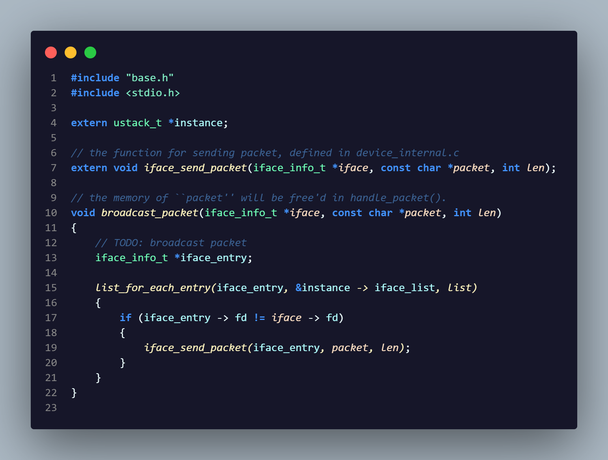

2. 验证广播网络能够正常运行
   - 三个节点各自向其它两个节点发送消息，验证其两两相互连通。
     - h1 节点的验证结果如下：
        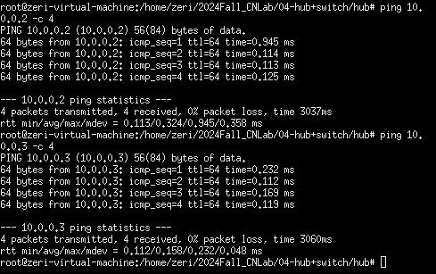
     - h2 节点的验证结果如下：
        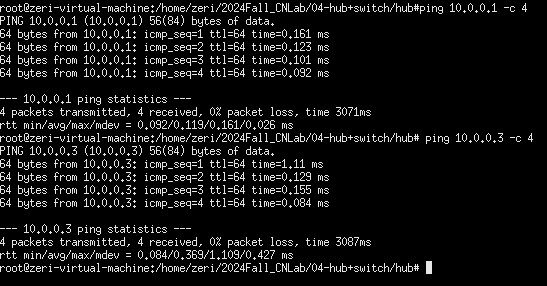
     - h3 节点的验证结果如下：
        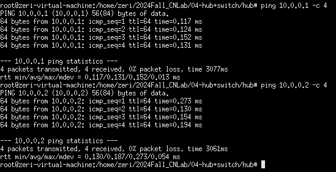
   - 综上，三个节点两两连通，广播网络能够正常运行  

#### （二）验证广播网络的效率

1. 网络的拓扑结构如下所示：
    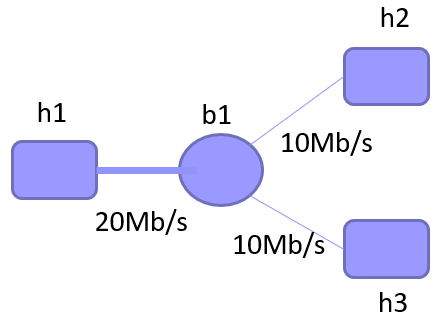

2. h1 向 h2 和 h3 同时传输
   - h1 向 h2 传输的结果如下：
        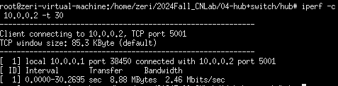
   - h1 向 h3 传输的结果如下：
        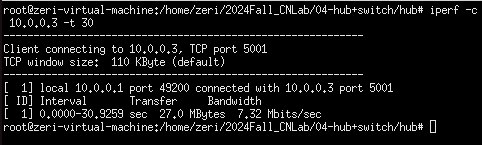
   - 从上图可以看出，h1 到 h2 实际传输速率和 h1 到 h3 实际传输速率都小于h2/h3 到b1的带宽（10.0Mb/s）。同时我们也能注意到两者速率加起来差不多正好达到 b1 到 h2/h3 的带宽（10.0Mb/s）。
   这是由于 h1 发给 h2的数据在 b1，会同时广播给 h2 和 h3，这样给 h2 的数据也会占据 h3 的传输带宽。同理，h1 发给 h3 的数据也会占据b1到h2的传输带宽。于是 b1 到 h2 和 b1 到 h3 两条传输通路都会传输h1发送给h2和h3的全部数据。因此 h1 到 h2 的传输速率与 h1 到 h3 的传输速率都会小于 b1 到 h2/h3 的带宽 10Mb/s。
   理论上来说，b1 到 h2 和 b1 到 h3 两条通路的效率应都为 50%左右。但实际中 h1 到h2 的速率与 hl 到h3 的速率有些差异，笔者认为这是受到了先后启动的影响，测试进程先启动的一方 TCP 窗口更大，速率会略大一些。但无论如何两者速率之和上限只有 10Mb/s，传输速率远没有达到带宽，可以看出广播网络效率低下。

3. h2 和 h3 向 h1 同时传输
   - h2 向 h1 传输的结果如下：
        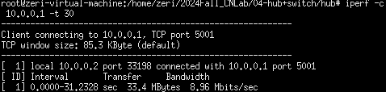
   - h3 向 h1 传输的结果如下：
        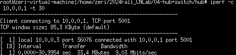
   - 从上图可以看出，实验中 h2 到 h1 和 h3 到 h1 的实际传输速率都接近 10Mb/s，与 h2/h3 到 b1 的带宽一致。
   这是因为，h2 发给 h1 的数据在 b1 处，会同时广播给 h1 和 h3；而 h3 发给 h1 的数据也会在 b1 处，同时广播给 h1 和 h2。但是这时数据并不是竞争关系，而是处于链路的两个不同方向。h2 给 h1 的数据从 b1 传到 h3，而 h3 给 h1 的数据从 h3 传到 b1，虽然他们都使用了 b1-h3 链路，但却是不同方向，互不影响，所以能达到链路最大带宽。而 b1 到 h1 链路带宽为 20Mb/s，刚好可以接收2个同时满带宽的 10Mb/s数据。因此在，路上的每一个链路带宽都被完全利用了，广播网络的效率达到最高。

4. 数据包在环路中不断广播
   - 对 three_nodes_bw.py 文件进行更改，将网络改为由2个 host 节点、3个 hub 节点构成的环状网络。
    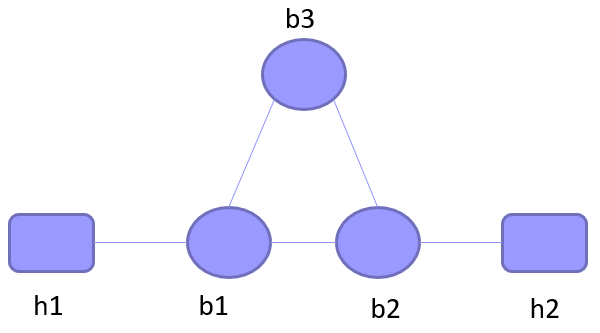
   - 其中，除了增加 b2 和 b3 节点的声明及相关定义外，最重要的是重新构建节点间的互联关系，以实现实验要求的环形拓扑。如下图所示，需要建立共计5条连接：b1 和 b2 和 b3 互相的连接、b1 和 h1 的连接、b2 和 h2 的连接。
   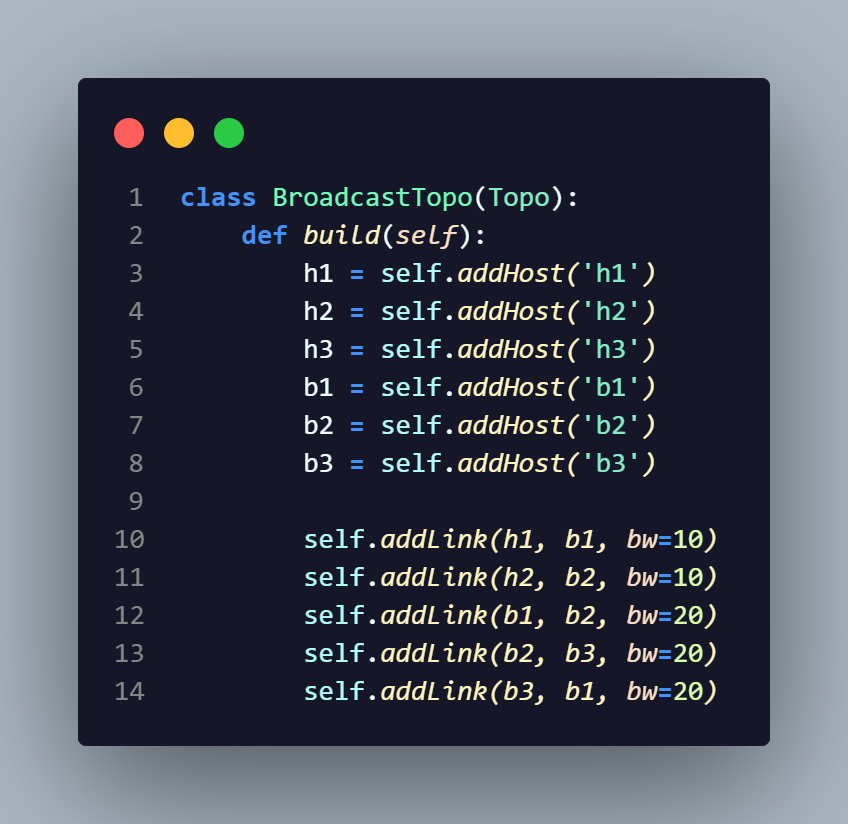
   部分抓包结果如下：
   
   - 从抓包结果可以看出，数据包在环路中不断广播，形成了数据包环路。
   造成这种数据包环路现象的原因是网络中 hub 节点构成了一个环。由于广播网络的工作模式，当网络包从 h2 达到 b2 后，b2 将数据包广播到 b3、b1。而下一时刻，b3 又将数据包广播到 b1，b1 又将数据包广播到 b3。之后它们又将数据包传回 b2，然后在 hub 环中重复上面的过程，这使得数据包的传输在网络中不断循环转发。

### 四、任务一：实验总结

通过本次实验，我对广播网络有了更多的了解。在本次实验中，我更加深入的明白了广播网络的工作方式，并直接体会到了广播网络的效率特点，知道了数据传输方向对其的影响，也明白了广播的方式效率不高。而在最后一个实验中，我深刻认识到广播网络有着致命的弱点。其要求拓扑结构不能有环路，否则会造成数据包在环路中不断被转发，占据资源，冬儿对网络产生极大破坏。

---

## 实验任务二（switch）

### 1.任务二：实验目的

了解交换机的转发原理和转发表的构建方式，理解交换机如何学习和维护转发表。实现转发表的数据结构，支持转发表的查询、插入、老化操作，完成一个能自动学习转发表的交换机。使用 iperf 和给定的拓扑进行测试，对比交换机转发与之前集线器广播的性能差异。  

### 2.任务二：实验流程

1. 实现对数据结构mac_port_map的所有操作，以及数据包的转发和广播操作
   - iface_info_t *lookup_port(u8 mac[ETH_ALEN]);
   - void insert_mac_port(u8 mac[ETH_ALEN], iface_info_t \*iface);
   - int sweep_aged_mac_port_entry();
   - void broadcast_packet(iface_info_t \*iface, const char \*packet, int len);
   - void handle_packet(iface_info_t *iface, char \*packet, int len);
2. 使用 iperf 和给定的拓扑进行实验，对比交换机转发与集线器广播的性能

### 3.任务二：实验结果与分析

#### （一）实现对数据结构mac_port_map的所有操作，以及数据包的转发和广播操作

1. 交换机查询操作：
    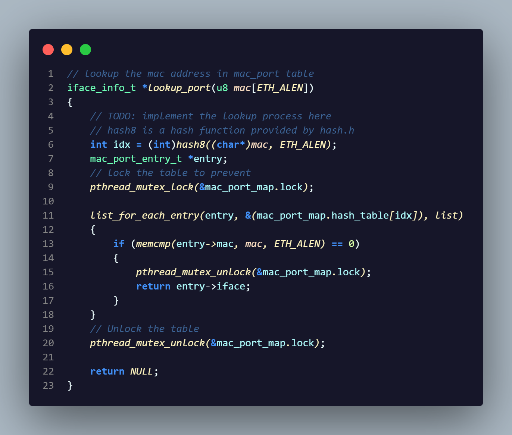

2. 交换机插入操作：
    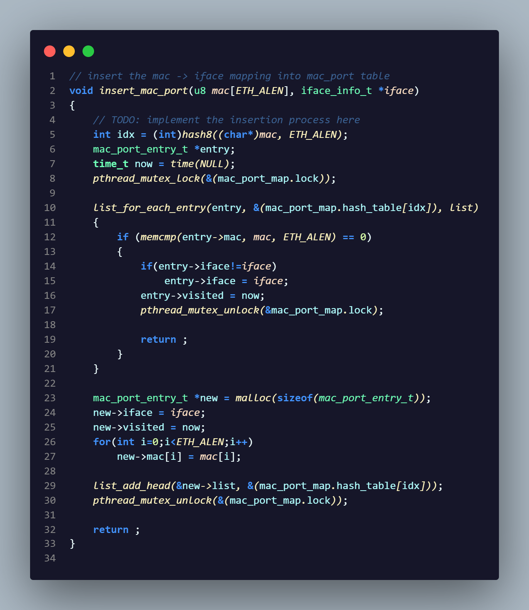

3. 交换机老化操作：
    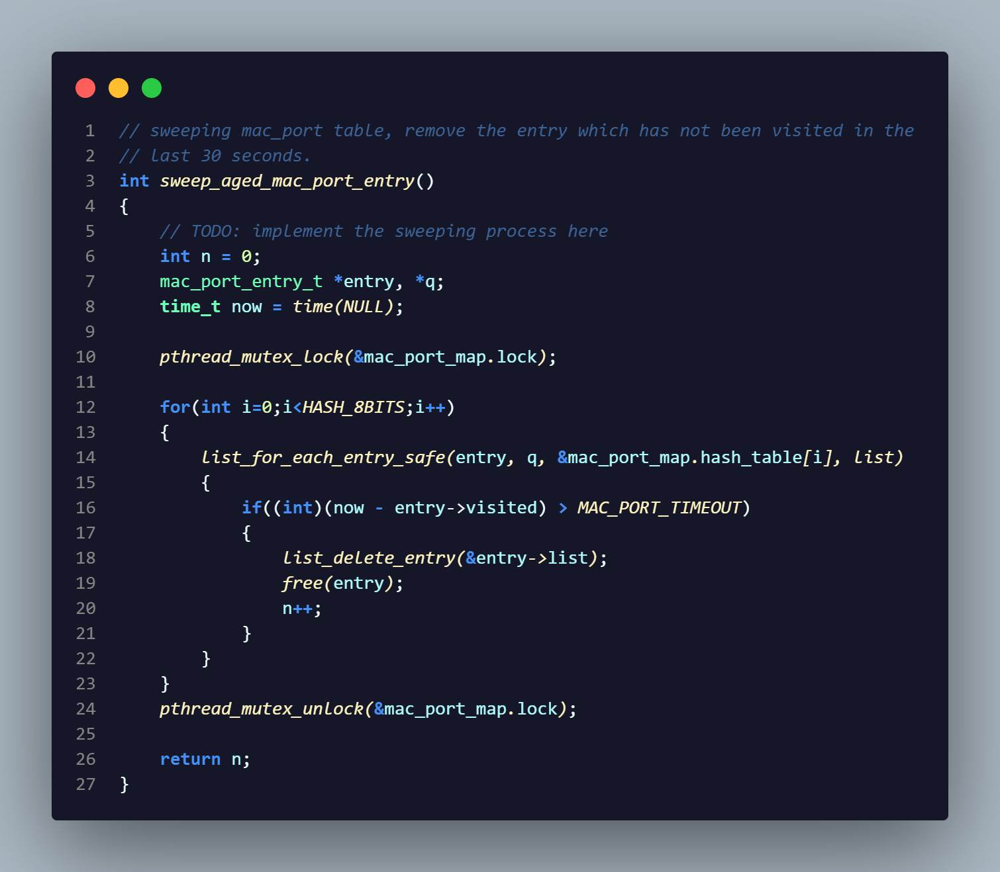

4. 交换机广播操作（与任务一相同，不重复展示）

5. 交换机处理数据包操作：
    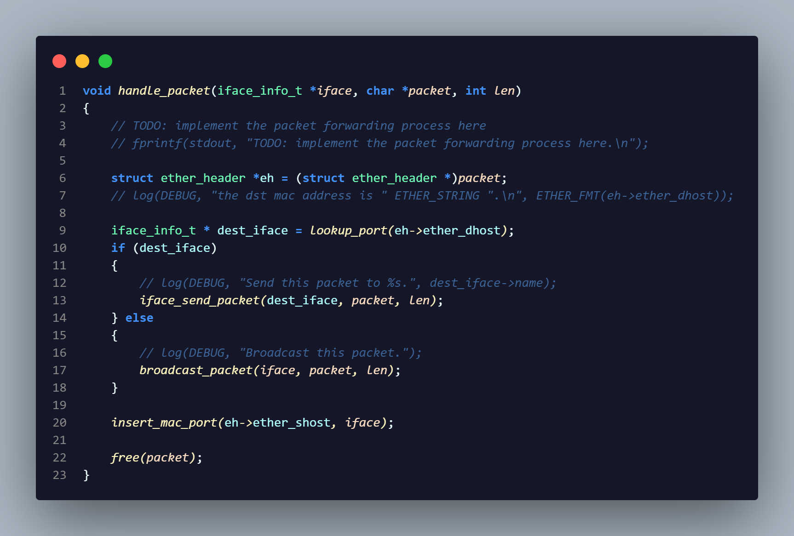

#### （二）使用 iperf 和给定的拓扑进行实验，对比交换机转发与集线器广播的性能

1. 网络的拓扑结构如下所示：
    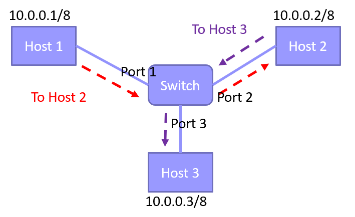

2. h1 向 h2 和 h3 同时传输
   - h1 向 h2 传输的结果如下：
        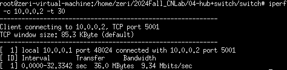
   - h1 向 h3 传输的结果如下：
        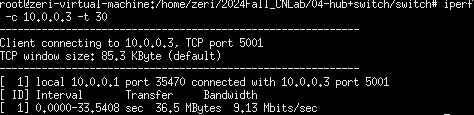
   - 从上图可以看出，实验中 h2 到 h1 和 h3 到 h1 的实际传输速率都接近 10Mb/s，与 h2/h3 到 b1 的带宽一致，可以说各自链路都充分利用了各自带宽。
   在交换机的情况下，除了第一次通讯时由于转发表为空需要广播数据包以外，由于服务端会发送响应包，所以，从第二个数据包开始，交换机就直接只向对应的端口进行转发，使得连接 h2 和 h3 的两条通路可以相对独立地进行数据收发。这样带宽得到了充分的利用，此时，只有交换机转的软件处理的时间（如交换表查询等操作）可能影响传输的效率。

3. h2 和 h3 向 h1 同时传输
   - h2和h3向h1传输的结果如下：
        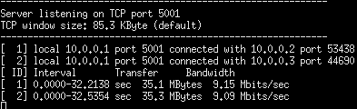
   - 从上图可以看出，实验中 h2 到 h1 和 h3 到 h1 的实际传输速率都接近 10Mb/s，与 h2/h3 到 b1 的带宽一致，可以说各自链路都充分利用了各自带宽。而具体原因与上一个测量实验（h1向h2和h3同时传输）一致，这里不进行赘述了，这种情况下广播网络也能充分利用各自的带宽，具体原因可见实验任务一。  

4. 交换机转发与集线器广播性能对比
   - 对于集线器广播方式，从实验任务一中可以得知，h1向h2和h3发送时，总体速率远小于其对应的带宽。这是因为广播方式会将数据包向所有端口发送，占用其他链路的带宽。交换机在第一次转发时，也是广播方式。但之后学习到 MAC 地址和端口的对应关系之后，就只向目的端口发送数据包，只占用该链路带宽。因此总体上利用率可以拉满，实际传输速率接近满带宽。
   而对于 h2和 h3同时向h1发送数据时，集线器和交换机没有什么差异，都能完全利用带宽（具体分析可参见前文）。  
   但总的来说，交换机的性能较好，它在学习完毕后可以定向发送数据包，没有无用数据挤占带宽。同时它不受传输方向的影响，上下行效率一致。而集线器效率受传输方向影响很大，上下行不对等，坏的情况下效率很低。此外在节点更多后无用数据会更加挤占带宽，性能受到局限。  

### 4.任务二：实验总结

通过本次实验，我对交换机及其工作原理有了更加深入的了解。首先，我学到了交换机的工作方式，即通过转发表来学习MAC地址与端口的对应关系，以此优化转发。其次，我知道了转发表的组织结构，明白了转发表的一些基本操作，并且本次实验中，我实现了转发表和交换机，并对比分析了集线器和交换机的性能差异，这让我对交换机的优势以及其巧妙的设计有了更准确的认识，这让我对交换机有了更深的理解。
