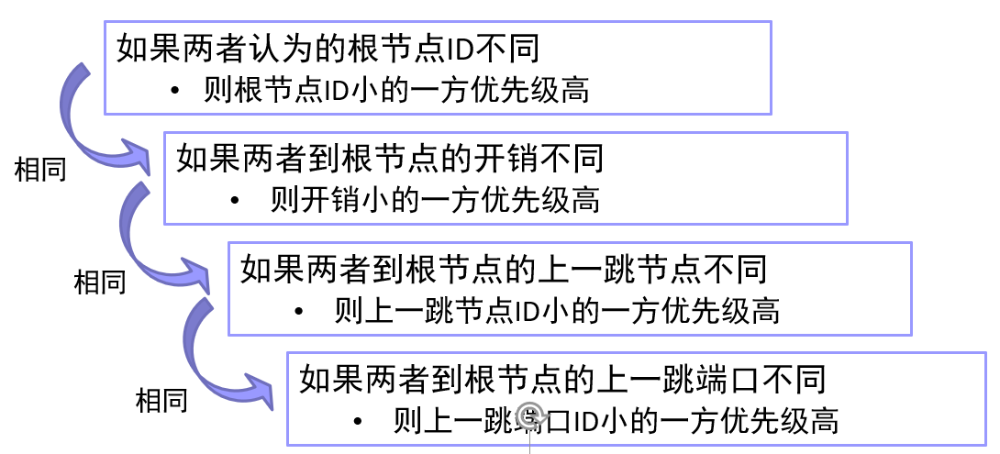

# 生成树机制实验

学号：2022K8009929011  
姓名：王泽黎  

---

## 一、实验任务

## 二、实验流程

## 三、实验结果与分析

### （一）实现生成树运行机制

#### 1. 总体逻辑

#### 2. 节点主动发送 Config 消息

当节点认为自己是根节点时， 周期性主动发送 Config 消息，节点通过 hello 定时器周期发送 Config 消息，直到该节点不再认为自己是根节点为止。

#### 3. 处理 Config 消息

##### （1）Config 优先级比较

当端口收到的 Config 消息之后或节点更新状态，从所有非指定端口中选取根端口时，进行 Config 消息的优先级比较，逻辑如下：

实现代码如下：

##### （2）更新端口的 Congfig

如果收到的 Config 优先级更高，就把本端口的 Config 替换为收到的 Config 消息，之后再进行后续处理。如果本地 Config 优先级更高，不做更改，若该端口是指定端口，发送 Config 消息，如下所示：

##### （3）更新节点状态

遍历所有端口，尝试找到根端口。如果存在根端口，则该节点为非根节点，选择通过root_port 连接到根节点，更新节点认定的根、到根节点的路径开销、根端口。

##### （4）更新其余端口的 Config

对于非指定端口：

对于所有指定端口：

### （二）4节点拓扑的最小生成树

使用stp程序计算输出最小生成树拓扑，实验结果如下：

可以看到 b1 节点为根节点，其两个端口都为指定端口。b4 节点的2端口为 AP 端口，不参与构建生成树拓扑其他节点和端口也都符合预期的拓扑结构。由此可以看出该生成树算法功能正确。

### （三）8节点拓扑的最小生成树

使用stp程序计算输出最小生成树拓扑，实验结果如下：

经过分析，该实验结果满足生成树要求。可见我们的生成树算法功能是正确的。

## 四、实验总结

通过本次实验，我对生成树的拓扑结构和生成树机制的基本原理有了一定的了解。我学到了如何在网络中实现唯一的、基于优先级的生成树，掌握了处理Config消息的流程。
